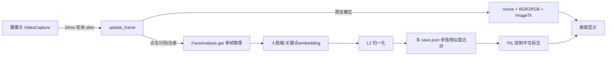

# 技术细节

本文档面向开发者,说明本项目的人脸识别原理、实现细节与性能特征。普通用户可忽略。

## 1. 系统架构

单进程、单线程的桌面应用,基于 Tkinter 事件循环:



- **线程模型**:所有逻辑(摄像头读取、模型推理、绘制)都在 Tk 主线程内,通过 `root.after(20)` 定时轮询,避免了多线程 GUI 的复杂性,从根上杜绝竞态崩溃;
- **卡顿控制**:推理(CPU 上约 0.3~0.6s/帧)只发生在用户点击"识别当前画面"/"注册人脸"的**单帧**上,平时预览完全不跑模型,因此画面永远流畅;识别结果帧被缓存(`last_frame`)并停留 2.5s 再恢复实时预览;
- **错误兜底**:顶层 `try/except` 捕获一切异常并写入 `error.log`;所有 JSON 读写均有容错,文件缺失/损坏时按空数据处理。

## 2. 人脸识别流程

识别基于 [InsightFace](https://github.com/deepinsight/insightface) 的 `buffalo_l` 模型包,首次运行自动下载到 `~/.insightface/models/buffalo_l/`,由 5 个 ONNX 模型组成:

| 模型文件 | 任务 | 输入尺寸 | 说明 |
|---|---|---|---|
| `det_10g.onnx` | 人脸检测 | 640×640 | SCRFD 轻量检测器,输出人脸框 + 5 点关键点 |
| `w600k_r50.onnx` | 特征提取 | 112×112 | ResNet-50,WebFace600K 训练,输出 **512 维 embedding** |
| `genderage.onnx` | 性别/年龄 | 96×96 | 辅助属性(本项目未使用) |
| `1k3d68.onnx` | 3D 关键点 | 192×192 | 68 点三维关键点(本项目未使用) |
| `2d106det.onnx` | 2D 关键点 | 192×192 | 106 点关键点(本项目未使用) |

单帧推理链路:检测 → 基于 5 点关键点做仿射对齐到 112×112 → 送入识别网络得到 embedding。本项目只使用 `detection` + `recognition` 两个任务,其余模型随包加载但不在比对流程中。

## 3. 特征比对原理

### 3.1 为什么必须归一化

`face.embedding` 是一个 512 维浮点向量,**其模长不是 1**。直接做点积时,结果 = 两向量模长之积 × 夹角余弦,实测同模型两张人脸的原始点积可达 **459**,因此 `>= 0.75` 这类阈值完全失效(任何人都会"匹配上"任何人)。

对两个向量分别做 L2 归一化(除以自身模长)后,点积即等于**余弦相似度**:

```
cos(θ) = (a · b) / (||a|| · ||b||)     范围: [-1, 1]
```

代码中的实现:

```python
def normalize(emb):
    emb = np.asarray(emb, dtype=np.float32)
    return emb / (np.linalg.norm(emb) + 1e-6)   # 1e-6 防止除零
```

### 3.2 阈值 0.75 的含义

`buffalo_l` 特征空间的余弦相似度经验分布:同一人不同照片通常 **> 0.7**,不同人通常 **< 0.5**。0.75 是"宁可漏认、不可错认"的保守值,界面滑块可在 0.50~0.95 间调整。本项目实测:标准测试图 `lena.jpg` 与已注册人员 `Elmh` 的相似度仅 **0.074**,被正确判为陌生人。

### 3.3 旧数据兼容

早期版本保存的 embedding 未归一化。比对时对 `save.json` 中每条数据**先归一化再点积**,因此旧数据无需重新录入;新保存的数据统一为归一化向量。

## 4. 界面与绘图实现

- **中文标注**:`cv2.putText` 只支持 ASCII,中文会显示为乱码。本项目将帧转为 RGB 后用 **PIL `ImageDraw` + 微软雅黑**(`msyh.ttc`,带 `simhei.ttf`/`arial.ttf` 回退)绘制姓名与置信度,并垫黑色半透明底条保证可读性,再转回 BGR 显示;
- **帧管线**:原始帧 → `cv2.resize` 到 640×480 → `BGR2RGB` → `PIL.Image` → `ImageTk.PhotoImage`(引用保存在 `self.imgtk` 防止被 GC 回收);
- **配色**:黑白灰五级灰阶(`#1c1c1e` 背景 → `#f2f2f2` 文字),识别框白色=认识、灰色=陌生人,无彩色装饰;
- **识别结果停留**:识别帧缓存到 `self.last_frame`,通过 `preview_paused` 标志在 2.5s 内持续显示该帧,避免推理间隙画面跳动。

## 5. 数据格式

`save.json` 为 JSON 数组,每项:

```json
{
  "name": "张三",
  "embedding": [0.0123, -0.0456, "...共512个浮点数"]
}
```

- 一个名字可对应多条记录(多次注册同一人),比对时取相似度最高者;
- 文件位置固定为脚本所在目录(通过 `__file__` 解析,不依赖当前工作目录,避免相对路径坑);
- 出于隐私考虑,`save.json` 与 `error.log` 均被 `.gitignore` 排除,不会进入公开仓库。

## 6. 依赖与兼容性

本项目在以下环境实测通过(Windows):

| 组件 | 版本 |
|---|---|
| Python | 3.13.2 |
| insightface | 1.0.1 |
| onnxruntime | 1.28.0(CPUExecutionProvider) |
| opencv-python | 5.0.0 |
| numpy | 2.4.4 |
| pillow | 12.2.0 |

- **GPU 自动选择**:启动时检查 `onnxruntime.get_available_providers()`,存在 `CUDAExecutionProvider` 则用 `ctx_id=0`,否则回退 CPU(`ctx_id=-1`);安装 `onnxruntime-gpu` 即可自动启用 GPU;
- 模型推理实测 CPU 单帧约 0.3~0.6s(640×640 检测 + 112×112 识别),GPU 可提升一个数量级;
- `start.bat` 采用 GBK 编码 + CRLF 换行,兼容中文 Windows cmd(UTF-8/LF 的批处理文件会导致 cmd 解析错乱,这是踩过的坑)。

## 7. 已知限制与改进方向

**当前限制**

- 仅支持单个摄像头(`VideoCapture(0)`);
- 数据存于单个 JSON 文件,适合家庭/小团队(几十人级),千人级以上应换 SQLite 或向量数据库;
- **无活体检测**:静态照片可冒充注册者,用于门禁等安全场景前必须叠加活体检测;
- 推理在主线程执行,识别瞬间界面会短暂停顿(0.3~0.6s),可接受但非最优。

**改进路线**

- 推理放到后台线程 + 结果队列,实现"流畅预览 + 后台实时识别";
- 接入活体检测(眨眼/IR 摄像头);
- 用 PyInstaller 打包为免安装 exe,进一步降低普通用户使用门槛;
- 添加识别记录(时间、姓名、相似度)与导出功能;
- 支持多个摄像头切换与视频文件回放。
